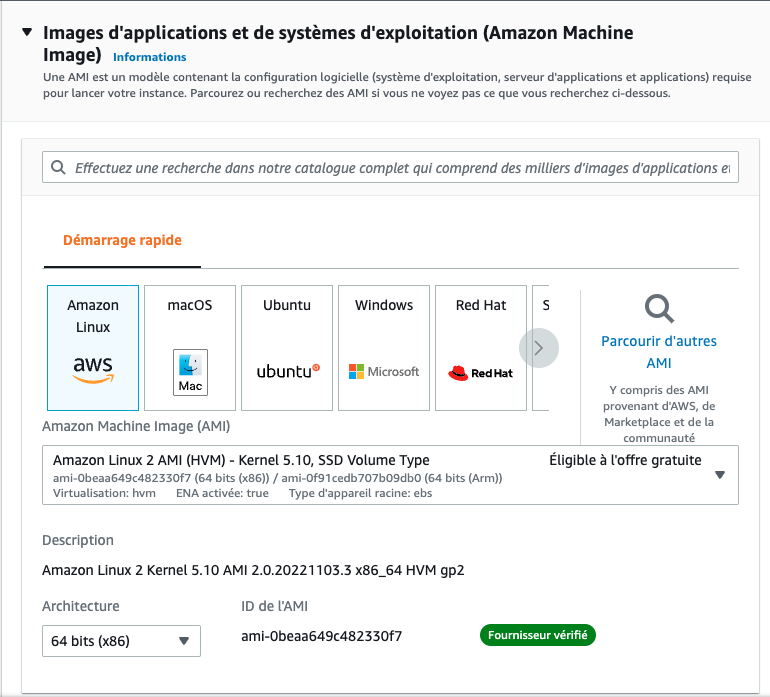
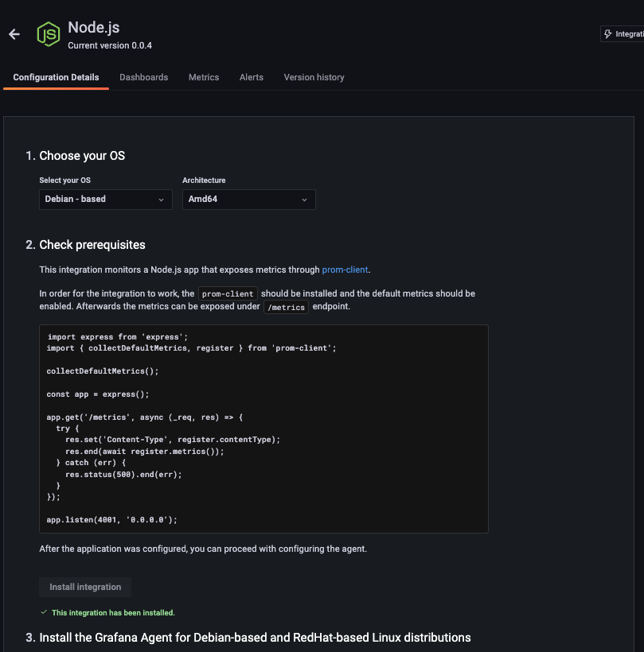

# Cas Pratique DevOps

## Pré-requis

- Read about Docker Multi-Stage build
- AWS Account avec une instance EC2 gratuite
- Grafana Cloud Account
- Github Account (Facultatif)

## Temps

- 1h à 2h 

## Objectif

Le but est de voir comment vous abordez un sujet technique, comprendre les problèmes que vous rencontrez et votre manière de les résoudre.

Les pré-requis et les suggestions sont là pour vous faire gagner du temps, vous pouvez utiliser d'autres outils si vous êtes plus à l'aise avec.

## Rendu 

Procédure expliquant la mise en oeuvre de la solution. Un simple fichier texte est suffisant.

## Exercice

Déployer un service web sous Docker dans le cloud et récupérer les métriques Node.js sur Grafana 

- Récupérer le projet https://github.com/NeoSpheres/devops-assessment
- Réparer le Dockerfile qui comporte une erreur de build
    
    ```bash
    docker build -t myapp .                                                                                                                                              13:06:52
    Sending build context to Docker daemon  4.096kB
    Step 1/9 : FROM node:lts-alpine3.16 as deps
     ---> 6e983a17c040
    Step 2/9 : WORKDIR /app
     ---> Using cache
     ---> d0b422cb8552
    Step 3/9 : COPY package.json ./
     ---> Using cache
     ---> 6e375c946e5c
    Step 4/9 : FROM node:lts-alpine3.16 AS builder
     ---> 6e983a17c040
    Step 5/9 : WORKDIR /app
     ---> Using cache
     ---> d0b422cb8552
    Step 6/9 : COPY . .
     ---> 9efc02c22ddc
    Step 7/9 : COPY --from=deps /app/node_modules ./node_modules
    COPY failed: stat app/node_modules: file does not exist
    ```
    
- Déployer le conteneur sur une instance EC2
    
    
    
- Récupérer les métriques NodeJS dans Grafana en suivant le guide d’intégration sur votre instance Grafana (https://INSTANCE-NAME.grafana.net/a/grafana-easystart-app/nodejs).
    - Le conteneur expose “/metrics” (Etape 2)
        
        
        

## Bonus

- Build automatique du conteneur lors d'un push    

- Automatiser le déploiement du conteneur
    - Idées : 
        - Ansible
        - Github Actions
        - Terraform

- Exposer le service sur le port 443 et sécuriser le trafic avec HTTPS (Nginx, Haproxy, Openssl, Let’s Encrypt)
    - Idées pour exposer le service: 
        - Nginx ou Haproxy
        - Dans le conteneur docker ou sur l'instance EC2
    - Idées pour sécuriser le trafic en HTTPS : 
        - Openssl (certificat auto-signé)
        - Let's Encrypt
